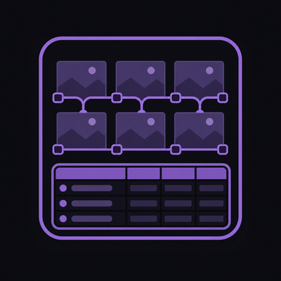

  

# Storyboard Suite — pre-production ноды для ComfyUI

**[English](README.md)** · Русский

Пак нод для планирования генерации прямо внутри ComfyUI. Карта-ассет канала **@itsmyshnikov**.

| Нода | Назначение |
|------|------------|
| **Text Table** | Библиотека промптов: name, prompt, negative, weight |
| **Frame Grid** | Один кадр + `width`/`height` (INT) для EmptyLatentImage |
| **Frame Grid (Batch)** | Все кадры списком — батч за один Queue Prompt |
| **Sheet** | Contact-sheet: батч IMAGE или слоты `image_1..9` → лист с подписями |
| **Cells** | Загрузка картинок прямо в ячейки → contact-sheet (без генерации) |

GPU не нужен — это обычный Python + JS, не генерация.

## Установка

1. Скопируй папку `comfyui-storyboard-suite` в `ComfyUI/custom_nodes/`.
2. Перезапусти ComfyUI.
3. Правый клик → **Add Node → Storyboard**.

Зависимостей нет (`requirements.txt` пустой).

## Как пользоваться

### Text Table

- UI-таблица: Name / Prompt / Negative / Weight.
- Тулбар: **+ Add row**, **Duplicate**, **Delete**.
- Выходы → `CLIP Text Encode` (prompt + negative).

### Frame Grid

- Выбор одного кадра (`select` по имени или индексу).
- **`base_resolution`** — длинная сторона (default 1024).
- Выходы **`width`** и **`height`** (INT, кратные 8) → `EmptyLatentImage`.
- **`all_prompts`** — все промпты через `\n---\n` (обзор сториборда).
- Drag-sort меняет порядок кадров; `select` сохраняет привязку по имени.

### Frame Grid (Batch)

- Те же кадры, но выходы — **списки** (`OUTPUT_IS_LIST`).
- Подключай к нодам, которые принимают list — один Queue прогонит все кадры.

### Storyboard Sheet

- Вход **`images`** (батч) **или** отдельные слоты **`image_1` … `image_9`** — можно подключить несколько Load Image без Batch Images.
- **`labels`** — multiline, по строке на кадр.
- Собирает contact-sheet → `SaveImage` / `PreviewImage`.

### Storyboard Cells

- Загрузи картинки **прямо в ноду** (кнопка «+» в ячейке).
- **Выход `sheet`** → сразу в **Preview Image** или **Save Image** (Sheet между ними не нужен).
- Queue → лист IMAGE + превью в ноде.
- Подписи: **`label_font_size`**, **`label_bar_height`** (0 = авто), **`label_color`**, **`label_bg_color`** — кириллица через `assets/DejaVuSans.ttf`.

> **Не подключай Cells → Sheet.** Cells уже отдаёт готовый лист. Sheet — для картинок из пайплайна (VAEDecode, Load Image).

Соотношения сторон: `21:9` … `9:21` (13 пресетов) в Frame Grid и Cells.

## Пример воркфлоу

`example_workflows/Storyboard Suite — prompt library + frame grid.json` — одиночный кадр + SD1.5.

`example_workflows/Storyboard Suite — contact sheet.json` — `FrameGridBatch` → sampler → `StoryboardSheet` → Save.

- `TextTable` → CLIP Text Encode (positive/negative)
- `FrameGrid.width/height` → EmptyLatentImage
- Checkpoint SD1.5 → KSampler → SaveImage

Нужен чекпойнт `v1-5-pruned-emaonly.safetensors` (стандартный SD1.5).

## Публикация

См. [PUBLISHING.md](PUBLISHING.md). Реестр: `comfyui-storyboard-suite`, Publisher `smyshnikof`.

MIT. См. [LICENSE](LICENSE).
